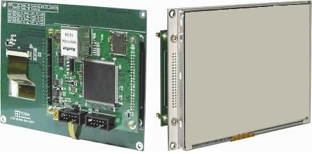
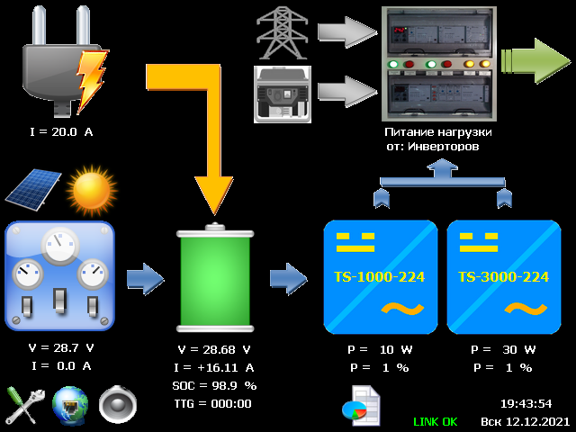

### Контроллер HMI системы резервного энергоснабжения.
---

Для контроллера используется модуль TE-LPC4088LCD5.6 компании "Терраэлектроника" на основе 5,6” цветного графического дисплея с сенсорным экраном и 32-разрядного ARM Cortex-M4 LPC4088FBD208 (NXP), 512 kB flash, 96 kB SRAM, SDRAM 64 MB, NOR Flash 4 MB, используемые интерфейсы: CAN, UART, MCI, Ethernet. Графический интерфейс построен с применением библиотеки [emWin](https://www.segger.com/products/user-interface/emwin/). Обмен данными с [управляющим контроллером](https://github.com/srgemb/Control) выполняется по CAN шине.

---

#### Функции:
* Управление компонентами системы резервного энергоснабжения с помощью графического интерфейса, [планировщика заданий](https://github.com/srgemb/Control/blob/master/Doc/scheduler.pdf) или через терминальный интерфейс (RS-232).

.
* Сбор статистики (параметров) работы компонентов системы с записью на SD карту.
* Обмен данными со сторонними приложениями по TCP Socket в режиме сервера.
* Удаленное управление через терминальный интерфейс Telnet.
* Обмен файлами по FTP.

---

#### История изменений.
* **Версия 2.1.1, 12.2021**  
Добавлен модуль планировщика заданий. Функционал идентичен функционалу аналогичного модуля управляющего контроллера. 
* **Версия 2.1.0, 11.2021**  
Отображение информации в экранных формах HMI изменено с учетом унифицированного функционала (описания) параметров компонентов системы.
* **Версия 2.0.0, 10.2021**  
Обмен данными с управляющим контроллером переведен на CAN шину.  
* **Версия 1.2.0, 12.2020**  
Реализовано управление и обмен данными по протоколам: TCP, Telnet, FTP с использованием сетевых компонентов RTOS.
* **Версия 1.1.0, 10.2020**  
Реализованы экранные формы HMI.
* **Версия 1.0.0, 06.2020**  
Реализован функционал обмена данными по SPI интерфейсу.

